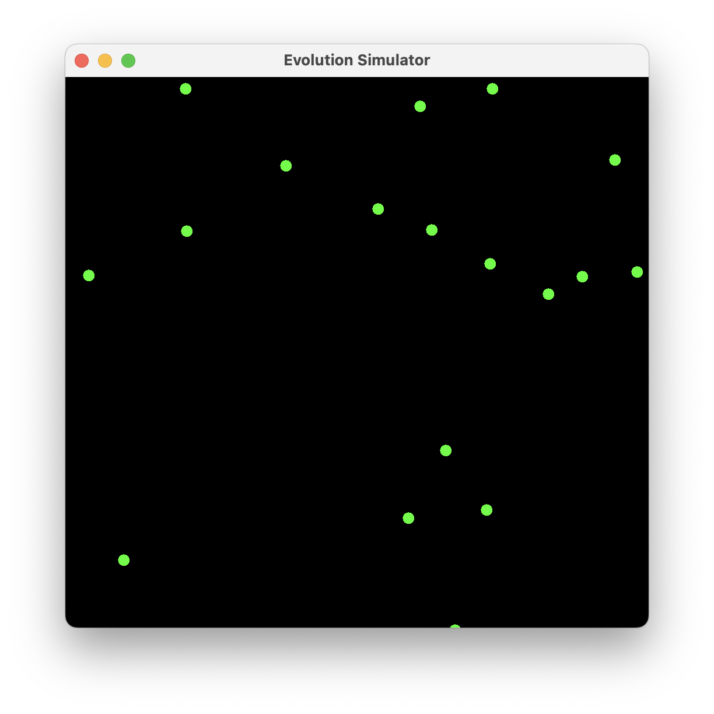

# Evolution Simulator

Evolution Simulator is a simple simulation program where creatures evolve over time by moving around and consuming food items.

## Features

- Creatures move randomly within the map.
- Food items are randomly generated on the map.
- Creatures can consume food items to gain energy.
- Creatures try to find the nearest food item and move towards it.

## Screenshot




### Prerequisites

- Java Development Kit (JDK) installed on your system
- IDE (e.g., IntelliJ IDEA, Eclipse) for Java development

### Installation

1. Clone the repository to your local machine:

    ```bash
    git clone https://github.com/yourusername/evolution-simulator.git
    ```

2. Open the project in your IDE.

3. Build and run the `App` class to start the simulation.

## Usage

- Once the simulation starts, you will see a window displaying the map.
- Creatures (represented by blue circles) will move randomly on the map.
- Food items will be generated on the map at regular intervals.
- Creatures will try to find and consume nearby food items to gain energy.

## Contributing

If you'd like to contribute to this project, please follow these steps:

1. Fork the repository.
2. Create a new branch (`git checkout -b feature/your-feature`).
3. Make your changes.
4. Commit your changes (`git commit -am 'Add some feature'`).
5. Push to the branch (`git push origin feature/your-feature`).
6. Create a new Pull Request.

## License

This project is licensed under the MIT License. See the [LICENSE](LICENSE) file for details.
